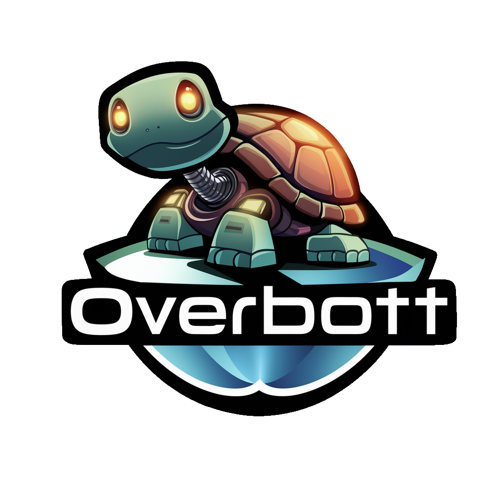

<p align="center">
</p>

<p align="center">
🌊 Welcome aboard the OverBott express, where innovation meets intuition and privacy races ahead at warp speed! 🚀🐢
</p>

<!-- <p>
  OverBott started with <a href="https://github.com/electron-react-boilerplate/electron-react-boilerplate">Electron React Boilerplate (React/ElectronJS/Webpack/MUI)</a>, coupled with LLM offline/online tools such as <a href="https://ollama.ai/">Ollama</a>, <a href="https://localai.io">LocalAI</a> and <a href="https://openai.com">OpenAI</a>.
</p> -->

<br>

<div align="center">

[![Build Status][github-actions-status]][github-actions-url]
[![Github Tag][github-tag-image]][github-tag-url]
[](https://discord.gg/Fjy3vfgy5q)

</div>

Get ready to dive into the digital future with OverBott, your ultimate sidekick for navigating the vast realms of AI-powered tools. Seamlessly blending with the leading tech pioneers like Ollama and OpenAI, OverBott propels your digital journey to new heights.

## Features / Stack

- Full Offline Capable / Privacy-first / Full data control (View/delete data, one click away)
- Preset system - Create/Manage/Export/Import presets with your favorite workflows
- Multiple LLM Providers (Offline & Online)
  - Locally Running Providers (Ollama, Localai, GPT4All, LlamaCPP)
  - Online Providers (OpenAI, MistralAI, Claude, Groq)
- RAG (Retrieval Augmented Generation) over PDF
- Local image generation with stable diffusion (supports HF models, pipelines, schedules)
- Text-to-speech 27 Languages with OpenTTS Server

## High-level Objectives

- Experiment around the foundation of the app
- Integrate with Ollama API [List/Pull/Delete/Chat/ChatCompletion]
- Integrate with LocalAI/OpenAI
- Implement Langchain (Create/manage Agents and Tools)
- Video/Music Player [Local/Spotify/Youtube/Vimeo/...]
- Mini Web browser (Allows agents to have access to vision+source in web-pages)
- Preset System (Create/Manage system presets/profiles)
- Voice System (OpenVoice TTS & STT/Elevenlabs)
- Command System
  - Shortcuts for everything
  - Create in chat commands
    - /play [music]
    - /draw [image]
    - /search [browser]
    - /study [subject]

## Research & Development

- Should we build this desktop only?
  - Pros: Somewhat niche specific, mostly users/businesses with more performant machines.
  - Cons:
    - Cannot deploy the solution somewhere online for better performance.
    - Cannot re-use full code-base (electron-side) in case of going Mobile
- Should we focus on RAG driven app only?
  - We should focus on SOMETHING, and RAG can be pretty broad.
    - We can focus on RAG for:
      - Q&A/Summarization
      - Question-Building (Study focused app)
- What other directions can a project like this take?

## Install

Clone the repo and install dependencies:

```bash
git clone --branch main https://github.com/splitpierre/overbott.git your-project-name
cd your-project-name
npm install
```

**Having issues installing? See our [debugging guide](https://github.com/electron-react-boilerplate/electron-react-boilerplate/issues/400)**

## Starting Development

Start the app in the `dev` environment:

```bash
npm start
```

## Packaging for Production

To package apps for the local platform:

```bash
npm run package
```

## Llama CPP (server setup)

```bash
git clone https://github.com/ggerganov/llama.cpp.git && cd llama.cpp
mkdir MODELS (Add guff Q4_0 models here)
# Add to .devops/server-vulkan.Dockerfile (or other images you need)
COPY MODELS /models
# Build docker image
docker build -t llama-cpp-vulkan:server -f .devops/server-vulkan.Dockerfile .
# Run and serve the docker image at port 4893 / Check change --device card and model name
# --n-gpu-layers should adjust according to video card VRAM available
# 8GBVRAM => 48 | 6GBVRAM => 32 | 4GBVRAM => 24 | 2GBVRAM => 12 ...

docker run -it --rm -v "$(pwd):/app:Z" --device /dev/dri/renderD128:/dev/dri/renderD128 --device /dev/dri/card0:/dev/dri/card0 -p 4893:4893 llama-cpp-vulkan:server -m "/models/Nous-Hermes-2-Mistral-7B-DPO.Q4_0.gguf"  --port 4893 --host 0.0.0.0 -n 2048 --n-gpu-layers 32
# Notice: At least on Vulkan, with AMD RX 570, only Q4_0 < 4gb models can be used.
```

## Unstructured API

```bash
docker pull downloads.unstructured.io/unstructured-io/unstructured-api:latest
docker run -p 8000:8000 -d --rm --name unstructured-api downloads.unstructured.io/unstructured-io/unstructured-api:latest --port 8000 --host 0.0.0.0
```

## OpenTTS

[API Swagger -> localhost:5500/openapi](http://localhost:5500/openapi/)

```bash
docker run -it -p 5500:5500 synesthesiam/opentts:en --no-espeak
```

## docker-diffusers-api

```bash
# Serve on 8077 (with/without gpu)
docker run --gpus all -p 8077:8000 -e HF_AUTH_TOKEN=$HF_AUTH_TOKEN gadicc/diffusers-api
docker run -p 8077:8000 -e HF_AUTH_TOKEN=$HF_AUTH_TOKEN gadicc/diffusers-api
```

<!-- ## Community

Join our Discord: https://discord.gg/Fjy3vfgy5q -->

## Donations

**Donations will ensure the following:**

- 🔨 Long term maintenance of the project
- 🛣 Progress on the [roadmap](https://electron-react-boilerplate.js.org/docs/roadmap)
- 🐛 Quick responses to bug reports and help requests

<!-- ## Sponsors

Become a sponsor and get your logo on our README on Github with a link to your site. [[Become a sponsor](https://opencollective.com/electron-react-boilerplate-594-594#sponsor)]

<a href="https://opencollective.com/electron-react-boilerplate-594/sponsor/0/website" target="_blank"></a> -->

## Troubleshooting

- **Issue:** After app install, making GPU driver changes might break Electron/App GPU associated cache cache.
  - ERROR:shared_context_state.cc(83)] Skia shader compilation error
  - find ~/.config/[Electron]/ -name "GPUCache" | xargs rm -rf
  - replace [Electron] to repo, electron and related caches to reset

## Maintainers

- [Pierre Silva](https://github.com/splitpierre)

## Acknowledgements

- [Ollama](https://ollama.ai) Local Model Management
- [LLaMAc++](https://github.com/ggerganov/llama.cpp/) LLM inference in C/C++
- [docker-diffusers-api](https://github.com/kiri-art/docker-diffusers-api) Diffusers / Stable Diffusion in docker with a REST API, supporting various models, pipelines & schedulers.
- [Voice TTS](https://github.com/synesthesiam/opentts) Text-to-speech 27 Languages with OpenTTS Server
- [LangChain](https://js.langchain.com/) AI Development Framework
- [Unstructured](https://github.com/Unstructured-IO/unstructured) Open source libraries and APIs to build custom preprocessing pipelines for labeling, training, or production machine learning pipelines.
- [ElectronJS](https://electronjs.org/) Base app & packaging
- [ReactJS](https://react.dev) GUI Engine
- [Material UI](https://mui.com/) Component/UI Tooling
- [Electron/React Boilerplate](https://electron-react-boilerplate.js.org)

* [CompVis](https://github.com/CompVis),
  [Stability AI](https://stability.ai/),
  [LAION](https://laion.ai/)
  and [RunwayML](https://runwayml.com/)
  for their incredible time, work and efforts in creating Stable Diffusion,
  and no less so, their decision to release it publicly with an open source
  license.
* [HuggingFace](https://huggingface.co/) - for their passion and inspiration
  for making machine learning more accessibe to developers, and in particular,
  their [Diffusers](https://github.com/huggingface/diffusers) library.

## License

MIT © [OverBott](https://github.com/splitpierre/overbott)

[github-actions-status]: https://github.com/electron-react-boilerplate/electron-react-boilerplate/workflows/Test/badge.svg
[github-actions-url]: https://github.com/electron-react-boilerplate/electron-react-boilerplate/actions
[github-tag-image]: https://img.shields.io/github/tag/electron-react-boilerplate/electron-react-boilerplate.svg?label=version
[github-tag-url]: https://github.com/electron-react-boilerplate/electron-react-boilerplate/releases/latest
